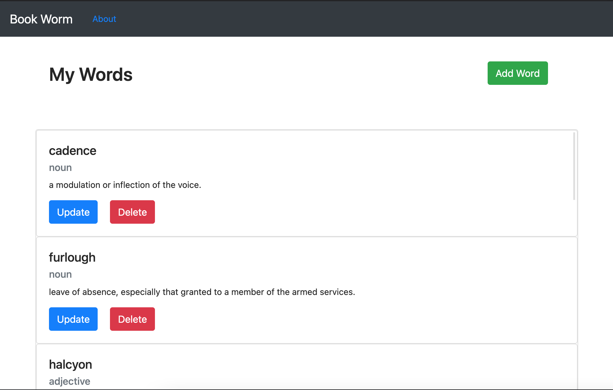
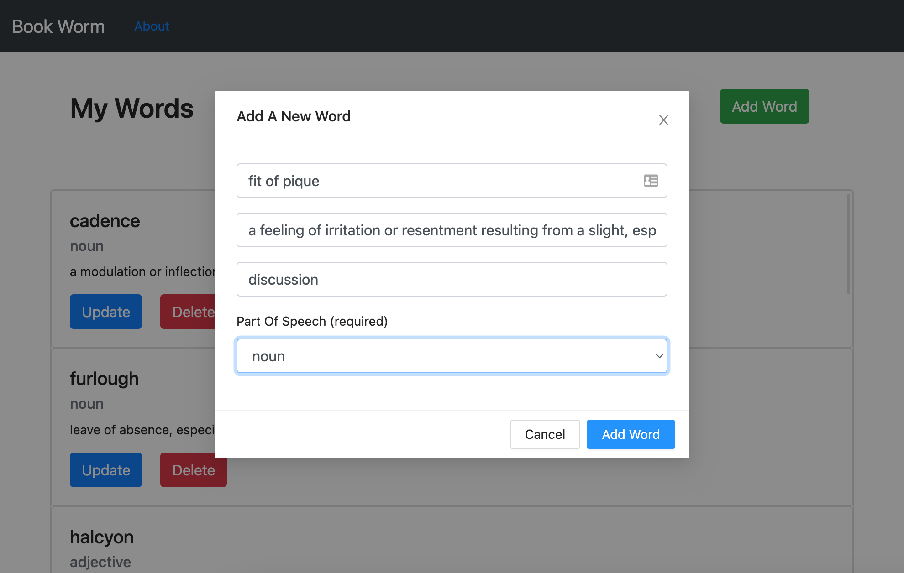

# BookWorm

Save the words you find in the books you read

## Table of Contents

-   [Description](#description)
-   [Deployed Application](#deployed-application)
-   [Installation](#installation)
-   [Usage](#usage)
-   [Credits](#credits)
-   [License](#license)

## Description

The motivation behind book worm was to have a place to keep track of all the words I kept coming across in the books I read. I wanted to have a place to store them and eventually do stuff with those words like study them and analyze them.

The current version of book worm only allows you to create, update, read, and delete words. This is the bare bones of the app but future generation of the app will have other cool features like flash card study and allowing you to analyze what authors you record the most words from and what books have contributed to your book worm vocabulary.

> technologies used:

```
React
NPM
Axios
Heroku
SQL
Sequelize
```

## Deployed Application

https://secret-sea-00453.herokuapp.com/

## Installation

To run this app you will need to setup an instance of SQL and install all npm dependiences before it will work.

in root run

> npm i

after setting up db instance run in root

> npm start

## Usage

Below are screenshots of my website.




## Credits

List of resources used:

https://ant.design/components/

https://getbootstrap.com/docs/5.0/

https://developer.mozilla.org/en-US/docs/

## License

No licenses.

---
